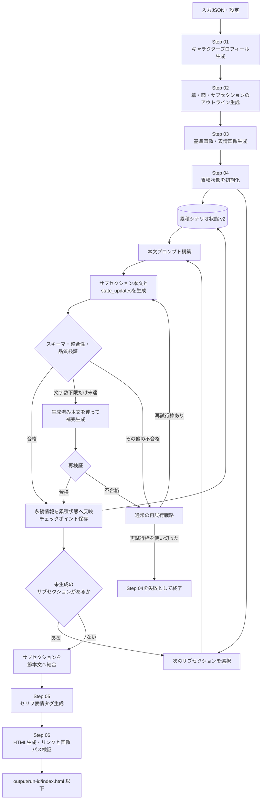

# Simple Scenario Generator for Udemy Lecture

シナリオの入力情報から、キャラクタープロフィール、アウトライン、キャラクター画像、章・節本文を段階的に生成するパイプラインです。

## 処理フロー



Step 04では、過去の本文全文を次のプロンプトへ連結しません。各サブセクションが返す
`state_updates`を累積状態へ反映し、現在地、所持品、判明事項、関係変化、登場済みの
エンティティ、未解決の伏線、直近状況の要約を次の生成へ渡します。

## 関連ドキュメント

- [PIPELINE.md](PIPELINE.md): パイプライン構成、設定、実行方法
- [IMAGE_GENERATION.md](IMAGE_GENERATION.md): 画像生成の設定、成果物、再開方法
- [SCENARIO_BODY_SPEC.md](SCENARIO_BODY_SPEC.md): シナリオ本文の生成仕様
- [SCENARIO_GENERATION_KNOWHOW.md](SCENARIO_GENERATION_KNOWHOW.md): シナリオ生成・画像生成のノウハウ集
- [requirements.md](requirements.md): 成果物と受け入れ条件

## 基本的な実行例

依存関係をインストールします。

```powershell
python -m pip install -r requirements.txt
```

mockプロバイダーで実行します。

```powershell
python run_pipeline.py `
  --config examples/pipeline.config.json `
  --input examples/input.json `
  --run-id mock-scenario-001
```

OpenAI APIで実行します。

```powershell
$env:OPENAI_API_KEY = "your-api-key"

python run_pipeline.py `
  --config examples/pipeline.openai.config.json `
  --input examples/input.json `
  --run-id openai-scenario-001
```

## 1セクションの文字数を変更する

本文は既定で1セクションを3つのサブセクションに分割し、サブセクションごとに
空白を除いて1,200文字を目標、1,000〜1,600文字を合格範囲として生成します。
生成後は従来どおり1つのセクションに結合されます。
各サブセクションで追加された場所、所持品、判明事項、関係、登場エンティティ、伏線は
構造化された累積状態へ反映されます。次の生成には過去の本文全文ではなく、この状態と
直近状況の短い要約を渡します。
文字数は設定ファイルの`scenario_body_generation`で変更できます。

```json
{
  "scenario_body_generation": {
    "subsections_per_section": 3,
    "target_characters": 1200,
    "min_characters": 1000,
    "max_characters": 1600
  }
}
```

- `target_characters`: モデルへ指示する生成目標
- `min_characters`: 品質検証で合格とする文字数の下限
- `max_characters`: 空白を除いた文字数の上限
- `subsections_per_section`: 1セクションを生成するときの内部的な分割数

既定の最終セクションは3,000〜4,800文字が合格範囲となり、約3,600文字を
生成目標とします。`min_characters <= target_characters <= max_characters`になるよう設定します。

既存runのキャラクター設定・画像・アウトラインを維持し、変更後の文字数で本文だけを
再生成する場合は、同じrun IDを指定してStep 04から強制再実行します。

```powershell
python run_pipeline.py `
  --config examples/pipeline.openai.config.json `
  --input examples/input.json `
  --run-id openai-scenario-001 `
  --from-step step-04-generate-sections `
  --force
```

分量調整の考え方やAPI利用量への影響は
[SCENARIO_GENERATION_KNOWHOW.md](SCENARIO_GENERATION_KNOWHOW.md)を参照してください。
