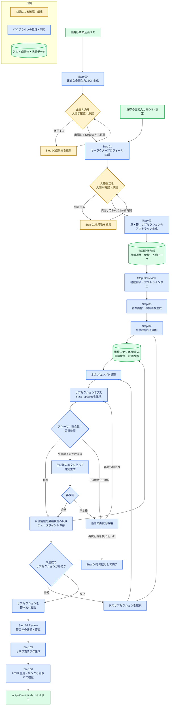

# Simple Scenario Generator for Udemy Lecture

シナリオの入力情報から、キャラクタープロフィール、アウトライン、キャラクター画像、章・節本文を段階的に生成するパイプラインです。

## 処理フロー



黄色は人間による確認・承認・編集、青色はパイプラインが自動実行する処理・判定、緑色は入力・
累積状態・生成成果物などのデータを表します。

Step 02 のアウトラインは、場面の順序だけでなく `story_plan` にプロットスレッド、伏線、
人物アークを保持します。各サブセクションの `planned_state_updates` は、本文で実現すべき
現在地、所持品、判明事項、関係変化、登場要素、伏線の提示・回収などを定義する契約です。
Step 02 Review は参照IDと時系列を検証し、Step 04 は実行済みの計画だけを
`state_after.plan_progress` に圧縮して次の生成単位へ渡します。

Step 04では、過去の本文全文を次のプロンプトへ連結しません。各サブセクションが返す
`state_updates`を累積状態へ反映し、現在地、所持品、判明事項、関係変化、登場済みの
エンティティ、未解決の伏線、直近状況の要約を次の生成へ渡します。

## シナリオの自動評価と修正

`scenario_review.enabled=true`にすると、アウトライン生成直後と節本文の結合直後に生成AIによる
評価・修正ステップを挿入します。

```json
{
  "scenario_review": {
    "enabled": true,
    "require_human_review": false
  }
}
```

アウトライン評価では企画上の事件順、登場時期、必須事項、抽象的・重複したイベントを検査し、
イベントIDと章節数を維持したまま具体的な出来事へ修正します。完成シナリオ評価では節全体を読み、
時系列、話者、人物らしさ、反復、場面進行、内部指示の混入、設定上の妥当性を検査して修正版を
出力します。評価結果は次の成果物に保存されます。

- `artifacts/step-02-review-outline.json`
- `artifacts/step-04-review-sections.json`

本文評価で原因がアウトラインにあると判定された場合は、自動的に曖昧な部分だけを隠して進まず、
Step 04 Reviewを失敗させます。評価内容を確認し、Step 02から再実行してください。
`require_human_review=true`の場合は各レビューステップの成功後に停止し、成果物を人間が確認してから
次のステップへ進めます。レビューは生成AI呼び出しを増やすため、処理時間とAPI利用量も増加します。

## 関連ドキュメント

- [PIPELINE.md](PIPELINE.md): パイプライン構成、設定、実行方法
- [IMAGE_GENERATION.md](IMAGE_GENERATION.md): 画像生成の設定、成果物、再開方法
- [SCENARIO_BODY_SPEC.md](SCENARIO_BODY_SPEC.md): シナリオ本文の生成仕様
- [SCENARIO_GENERATION_KNOWHOW.md](SCENARIO_GENERATION_KNOWHOW.md): シナリオ生成・画像生成のノウハウ集
- [requirements.md](requirements.md): 成果物と受け入れ条件

## 基本的な実行例

依存関係をインストールします。

```powershell
python -m pip install -r requirements.txt
```

mockプロバイダーで実行します。

```powershell
python run_pipeline.py `
  --config examples/pipeline.config.json `
  --input examples/input.json `
  --run-id mock-scenario-001
```

OpenAI APIで実行します。

```powershell
$env:OPENAI_API_KEY = "your-api-key"

python run_pipeline.py `
  --config examples/pipeline.openai.config.json `
  --input examples/input.json `
  --run-id openai-scenario-001
```

### 自由形式のアイデアから開始する（Step 00）

`--input`にはJSONだけでなく、文章、箇条書き、Markdownなどの自由形式ファイルを指定できます。
ファイルが`scenario_idea`と`character_overviews`を持つ正式なJSONでない場合、Step 00が
ファイル全文を企画メモとして読み込み、パイプライン用の入力JSONを生成します。例として
`examples/rough-idea.txt`を用意しています。

```powershell
python run_pipeline.py `
  --config examples/pipeline.openai.config.json `
  --input examples/rough-idea.txt `
  --run-id rough-idea-scenario-001
```

生成後はレビュー待ちで停止します。

```text
Run paused for review after: step-00-generate-planning-input
Review artifact: output/<run-id>/artifacts/step-00-generate-planning-input.json
```

成果物内の`input.scenario_idea`と`input.character_overviews`を確認し、必要なら直接編集します。
企画については題名、テーマ、前提、必須・禁止要素、章数、節数を確認してください。人物については
人数と役割だけでなく、外見、背景、性格、価値観、長所・短所、成長軸、話し方、人物関係、感情範囲、
表情ルールまで生成されるため、それぞれが企画意図に合っているか確認してください。
承認後は、元の自由形式ファイルと同じrun IDを指定してStep 01から再開します。

```powershell
python run_pipeline.py `
  --config examples/pipeline.openai.config.json `
  --input examples/rough-idea.txt `
  --run-id rough-idea-scenario-001 `
  --from-step step-01-generate-character-profiles
```

`--from-step step-01-generate-character-profiles`による再開をStep 00成果物への明示的な承認として
扱います。再開すると承認済みの企画入力が読み込まれ、Step 01で詳細な人物設定を生成した後、
もう一度人物設定のレビュー待ちで停止します。

自由形式入力を許可する設定は次のとおりです。OpenAI用サンプル設定では有効になっています。

```json
{
  "planning_input_generation": {
    "enabled": true,
    "require_review": true
  }
}
```

### Step 01の人物設定を確認・承認する

OpenAI設定では、Step 01で人物設定をAI生成した直後にパイプラインが正常終了ではなく
「レビュー待ち」として自動停止します。コンソールには次のように確認対象が表示されます。

```text
Run paused for review after: step-01-generate-character-profiles
Review artifact: output/<run-id>/artifacts/step-01-generate-character-profiles.json
```

確認対象のファイルは次のとおりです。

```text
output/<run-id>/artifacts/step-01-generate-character-profiles.json
```

次の手順で確認・承認します。

1. `character_profiles`に、意図した人数とキャラクターIDが含まれていることを確認します。
2. 性格、背景、成長軸、話し方、人物関係、外見、表情ルールを確認します。
3. 修正が必要なら、このJSONファイルを直接編集して保存します。
4. 内容を承認できたら、同じrun IDを指定してStep 02から再開します。

専用の対話式承認コマンドはありません。`--from-step step-02-generate-outline`による再開を
明示的な承認として扱います。

```powershell
python run_pipeline.py `
  --config examples/pipeline.openai.config.json `
  --input examples/input.json `
  --run-id openai-scenario-001 `
  --from-step step-02-generate-outline
```

再開時には、編集済みの人物設定をJSON Schemaで検証し、キャラクターID、人物関係の参照先、
利用可能な表情、優先表情、表情ルールの整合性も再検証します。不正な内容がある場合はStep 02へ
進まずエラーになるため、表示された項目を修正して同じコマンドを再実行してください。

自動生成を使わない場合は、設定ファイルで次のように指定します。

```json
{
  "character_profile_generation": {
    "enabled": false,
    "require_review": true
  }
}
```

## キャラクター初期設定

`examples/input.json`の`character_overviews`には、名前と概要だけでなく、本文・会話・画像生成で
維持したい人物設定を記述できます。

- 年齢、性別、所属・立場
- 外見、服装、基本ポーズ、画像生成用の補足
- 性格、価値観、長所、弱点、背景
- 主人公との関係、会話上の役割、成長軸
- 話し方、文の長さ、丁寧さ、一人称・二人称、口癖、禁止表現、セリフ例
- 他キャラクターとの関係、態度、呼び方
- 感情の範囲と状況別の表情ルール

これらはStep 01の構造化プロフィールへ引き継がれ、Step 03の画像プロンプトとStep 04の
本文プロンプトから参照されます。既存の簡易入力との互換性を保つため、追加項目は任意です。

参考スキーマに含まれていた監査作業固有の態度・疑念度・証拠厳格度・ヒント方針と、生成前には
確定しない画像ID・初登場シナリオIDは、汎用シナリオ生成への寄与が低いため採用していません。

## 画像を維持してStep 02から再生成する

章構成、登場順、主要イベントなどのアウトラインを変更した場合は、同じrun IDを使って
Step 02から再実行します。キャラクター設定と画像生成条件を変更していなければ、既存の画像と
画像チェックポイントを再利用できるため、画像生成APIを再度呼び出す必要はありません。

```powershell
python run_pipeline.py `
  --config examples/pipeline.openai.config.json `
  --input examples/input.json `
  --run-id openai-scenario-001 `
  --from-step step-02-generate-outline
```

この実行ではStep 03も処理対象になりますが、次の条件を満たす画像は生成せずに読み込みます。

- 以前の生成時と同じrun IDを使用している
- `--force`を指定していない
- キャラクタープロフィールを変更していない
- 画像モデル、寸法、スタイル、品質などの画像生成設定を変更していない
- `assets/characters/`の画像と`artifacts/images/**/*.json`のチェックポイントが残っている

`trace.jsonl`に`image_checkpoint_loaded`または`expression_crop_checkpoint_loaded`があれば
既存画像が再利用されています。`image_generated`が記録された画像については、チェックポイントの
欠落または生成条件の変更が検出され、新しく生成されています。

`--force`は指定した開始位置以降の全ステップへ適用されます。Step 02からの実行に付けると
Step 03も強制実行となり、すべてのキャラクター画像が再生成されます。アウトラインと本文だけを
更新したい場合は付けないでください。新しいrun IDには既存runの画像チェックポイントがないため、
そのままでは画像を再利用できません。

アウトラインのイベントは、本文へ表示する内容を表す`description`と、進行管理専用の`event_id`に
分離されています。`phase-1-beat-2`のような`event_id`はセリフやナレーションへ出力せず、
達成状況だけを`state_updates.completed_event_ids`へ記録します。内部IDが本文へ混入した場合は
品質検証で不合格になります。この形式へ更新する前のアウトラインを持つrunは、Step 02から
再生成してください。

## 1セクションの文字数を変更する

本文は既定で1セクションを3つのサブセクションに分割し、サブセクションごとに
空白を除いて1,200文字を目標、1,000〜1,600文字を合格範囲として生成します。
生成後は従来どおり1つのセクションに結合されます。
各サブセクションで追加された場所、所持品、判明事項、関係、登場エンティティ、伏線は
構造化された累積状態へ反映されます。次の生成には過去の本文全文ではなく、この状態と
直近状況の短い要約を渡します。
文字数は設定ファイルの`scenario_body_generation`で変更できます。

```json
{
  "scenario_body_generation": {
    "subsections_per_section": 3,
    "target_characters": 1200,
    "min_characters": 1000,
    "max_characters": 1600
  }
}
```

- `target_characters`: モデルへ指示する生成目標
- `min_characters`: 品質検証で合格とする文字数の下限
- `max_characters`: 空白を除いた文字数の上限
- `subsections_per_section`: 1セクションを生成するときの内部的な分割数

既定の最終セクションは3,000〜4,800文字が合格範囲となり、約3,600文字を
生成目標とします。`min_characters <= target_characters <= max_characters`になるよう設定します。

既存runのキャラクター設定・画像・アウトラインを維持し、変更後の文字数で本文だけを
再生成する場合は、同じrun IDを指定してStep 04から強制再実行します。

```powershell
python run_pipeline.py `
  --config examples/pipeline.openai.config.json `
  --input examples/input.json `
  --run-id openai-scenario-001 `
  --from-step step-04-generate-sections `
  --force
```

分量調整の考え方やAPI利用量への影響は
[SCENARIO_GENERATION_KNOWHOW.md](SCENARIO_GENERATION_KNOWHOW.md)を参照してください。
